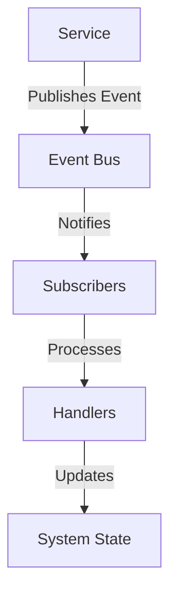
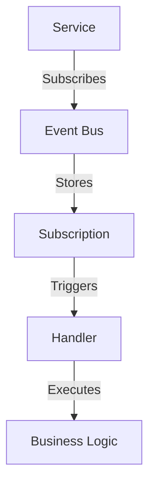

# Event System Architecture

## Overview

The event system provides a decoupled way to handle various system events, particularly for instrument updates, screener synchronization, and market data processing.

## Components

### 1. Event Bus Service

```typescript
@Injectable()
export class EventBusService {
  constructor(private eventEmitter: EventEmitter2) {}

  publish(event: BaseEvent): void {
    this.eventEmitter.emit(event.type, event);
  }

  subscribe(eventType: EventType, handler: (event: BaseEvent) => void): void {
    this.eventEmitter.on(eventType, handler);
  }
}
```

### 2. Event Types

```typescript
export enum EventType {
  INSTRUMENT_CREATED = 'instrument.created',
  INSTRUMENT_UPDATED = 'instrument.updated',
  SCREENER_UPDATED = 'screener.updated',
  MARKET_DATA_UPDATED = 'market.data.updated',
  INDICATOR_UPDATED = 'indicator.updated',
}
```

### 3. Base Event Interface

```typescript
export interface BaseEvent {
  type: string;
  payload: any;
  timestamp: number;
}
```

## Event Flow

### 1. Event Publishing



### 2. Event Subscription



## Usage Examples

### Publishing Events

```typescript
// In InstrumentService
@Injectable()
export class InstrumentService {
  constructor(private eventBus: EventBusService) {}

  async createInstrument(data: any): Promise<void> {
    // Create instrument logic
    this.eventBus.publish({
      type: EventType.INSTRUMENT_CREATED,
      payload: { instrumentId: data.id },
      timestamp: Date.now(),
    });
  }
}
```

### Subscribing to Events

```typescript
// In QueueManagerService
@Injectable()
export class QueueManagerService {
  constructor(private eventBus: EventBusService) {
    this.setupEventListeners();
  }

  private setupEventListeners(): void {
    this.eventBus.subscribe(
      EventType.INSTRUMENT_CREATED,
      this.handleInstrumentCreated.bind(this),
    );
  }
}
```

## Event Types and Payloads

### Instrument Events

```typescript
interface InstrumentEventPayload {
  instrumentId: number;
  data?: any;
  timestamp: number;
}
```

### Screener Events

```typescript
interface ScreenerEventPayload {
  screenerId: number;
  instruments?: number[];
  timestamp: number;
}
```

### Market Data Events

```typescript
interface MarketDataEventPayload {
  instrumentId: number;
  dataType: string;
  data: any;
  timestamp: number;
}
```

## Best Practices

1. **Event Design**

   - Keep events focused and atomic
   - Include necessary context in payload
   - Use consistent event naming
   - Version events when structure changes

2. **Event Handling**

   - Make handlers idempotent
   - Handle errors gracefully
   - Log event processing
   - Consider event ordering

3. **Performance**
   - Use async event processing
   - Implement event batching when possible
   - Monitor event processing times
   - Handle event backpressure

## Error Handling

### Event Processing Errors

```typescript
try {
  await this.eventBus.publish(event);
} catch (error) {
  this.logger.error(`Failed to publish event: ${error.message}`);
  // Implement retry logic or error reporting
}
```

### Event Handler Errors

```typescript
this.eventBus.subscribe(EventType.INSTRUMENT_CREATED, async (event) => {
  try {
    await this.handleEvent(event);
  } catch (error) {
    this.logger.error(`Failed to handle event: ${error.message}`);
    // Implement error recovery
  }
});
```

## Monitoring

### Event Metrics

- Event publishing rate
- Event processing time
- Error rates
- Queue lengths

### Logging

- Event lifecycle
- Processing errors
- Performance metrics

## Future Improvements

1. **Event Versioning**

   - Implement event versioning
   - Add backward compatibility
   - Support event migration

2. **Event Persistence**

   - Add event storage
   - Implement event replay
   - Support event sourcing

3. **Enhanced Monitoring**
   - Real-time event tracking
   - Performance analytics
   - Error reporting
