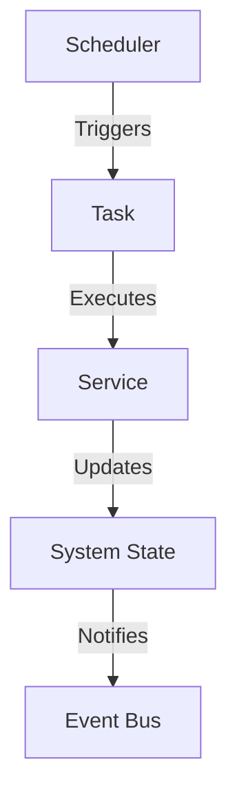
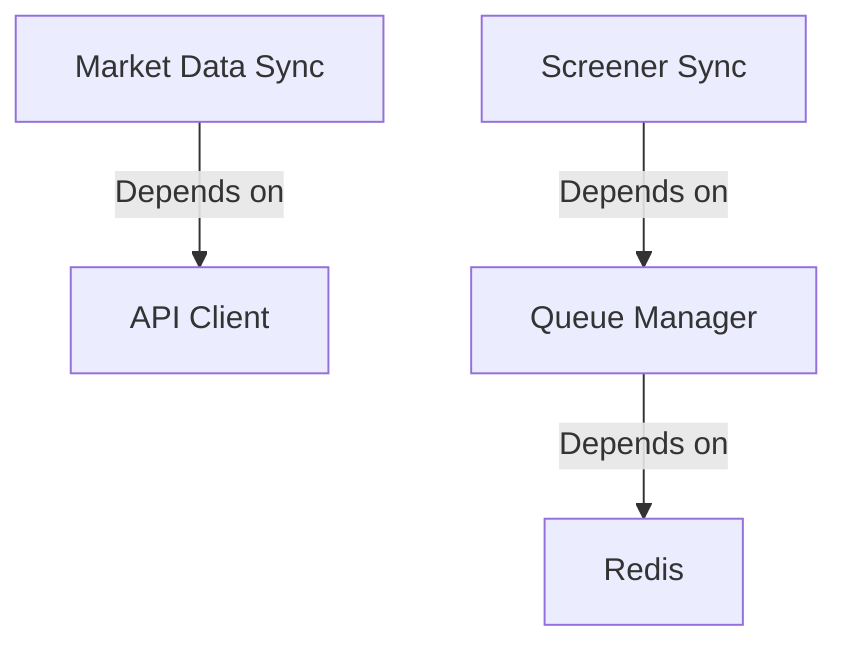

# Scheduling System Architecture

## Overview

The scheduling system manages periodic tasks and cron jobs for market data updates, screener synchronization, and other automated processes.

## Components

### 1. Scheduler Service

```typescript
@Injectable()
export class SchedulerService {
  constructor(
    private readonly queueManager: QueueManagerService,
    private readonly marketDataService: MarketDataService,
  ) {}

  @Cron(CronExpression.EVERY_10_MINUTES)
  async handleScreenerSync() {
    // Screener sync logic
  }

  @Cron(CronExpression.EVERY_5_MINUTES)
  async handleMarketDataSync() {
    // Market data sync logic
  }
}
```

### 2. Scheduled Tasks

#### Screener Synchronization

- Frequency: Every 10 minutes
- Purpose: Update screener data and indicators
- Dependencies: Queue Manager, Screener Service

#### Market Data Updates

- Frequency: Every 5 minutes
- Purpose: Update real-time market data
- Dependencies: Market Data Service
- TTL (Time To Live) Strategy:
  - During market hours: Data is cached for 15 minutes (900,000 milliseconds)
  - Outside market hours: Data is cached until the next market open
  - This ensures fresh data during active trading while optimizing resource usage during non-trading hours

## Task Flow

### 1. Scheduled Task Execution



### 2. Task Dependencies



## Configuration

### Cron Expressions

```typescript
export enum CronExpression {
  EVERY_5_MINUTES = '*/5 * * * *',
  EVERY_10_MINUTES = '*/10 * * * *',
  EVERY_HOUR = '0 * * * *',
  EVERY_DAY = '0 0 * * *',
}
```

### Task Configuration

```typescript
interface TaskConfig {
  name: string;
  cronExpression: string;
  enabled: boolean;
  retryAttempts: number;
  timeout: number;
}
```

## Usage Examples

### Defining Scheduled Tasks

```typescript
@Injectable()
export class SchedulerService {
  @Cron(CronExpression.EVERY_10_MINUTES)
  async handleScreenerSync() {
    try {
      this.logger.debug('Starting scheduled screener sync');
      await this.queueManager.addJob({
        type: 'sync-screener',
        data: {
          timestamp: Date.now(),
        },
        options: {
          attempts: 3,
          backoff: {
            type: 'exponential',
            delay: 1000,
          },
        },
      });
    } catch (error) {
      this.logger.error('Error in scheduled screener sync:', error);
    }
  }
}
```

### Task Dependencies

```typescript
@Injectable()
export class MarketDataScheduler {
  constructor(
    private readonly marketDataService: MarketDataService,
    private readonly eventBus: EventBusService,
  ) {}

  @Cron(CronExpression.EVERY_5_MINUTES)
  async syncMarketData() {
    // Market data sync logic
  }
}
```

## Error Handling

### Task Execution Errors

```typescript
try {
  await this.executeTask();
} catch (error) {
  this.logger.error(`Task execution failed: ${error.message}`);
  // Implement retry logic or error reporting
}
```

### Task Recovery

```typescript
@Cron(CronExpression.EVERY_HOUR)
async handleFailedTasks() {
  // Recovery logic for failed tasks
}
```

## Monitoring

### Task Metrics

- Execution success rate
- Execution time
- Error rates
- Resource usage

### Logging

- Task lifecycle
- Execution errors
- Performance metrics

## Best Practices

1. **Task Design**

   - Keep tasks focused and atomic
   - Implement proper error handling
   - Consider task dependencies
   - Use appropriate scheduling intervals

2. **Resource Management**

   - Monitor resource usage
   - Implement task throttling
   - Handle concurrent executions
   - Manage task timeouts

3. **Error Handling**
   - Implement retry mechanisms
   - Log all errors
   - Monitor error rates
   - Implement recovery procedures

## Troubleshooting

### Common Issues

1. **Task Not Executing**

   - Check cron expression
   - Verify service is running
   - Check for errors in logs

2. **High Error Rates**

   - Review error logs
   - Check dependencies
   - Verify data consistency

3. **Performance Issues**
   - Monitor execution times
   - Check resource usage
   - Review task frequency

## Future Improvements

1. **Task Management**

   - Dynamic task scheduling
   - Task prioritization
   - Task dependencies
   - Task monitoring dashboard

2. **Scalability**

   - Distributed task execution
   - Load balancing
   - Resource optimization

3. **Monitoring**
   - Enhanced metrics
   - Real-time dashboards
   - Alerting system
