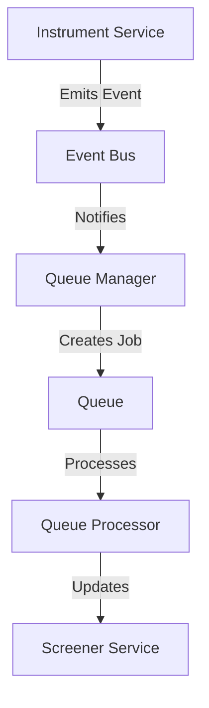
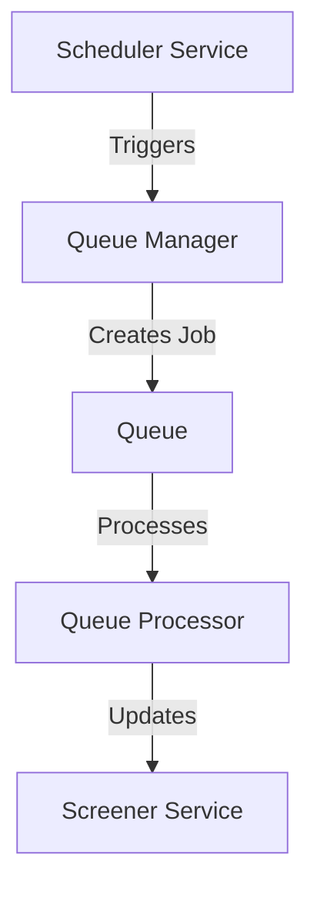

# Queue System Architecture

## Overview

The queue system is designed to handle asynchronous tasks and scheduled jobs in a decoupled manner, specifically for processing market data updates and screener synchronization.

## Components

### 1. Event System

- **EventBusService**: Central event bus for publishing and subscribing to events
- **Event Types**: Defined in `src/common/events/event.types.ts`
- **Base Event Interface**: Common interface for all events

### 2. Queue Management

- **QueueManagerService**: Handles job creation and queue management
- **Queue Configuration**: Redis-based queue using Bull
- **Job Interface**: Standardized job structure

### 3. Job Processing

- **QueueProcessorService**: Processes different types of jobs
- **Error Handling**: Retry mechanism with exponential backoff
- **Logging**: Comprehensive logging for debugging

### 4. Scheduling

- **SchedulerService**: Manages all scheduled tasks
- **Cron Jobs**: Configurable scheduling intervals
- **Task Management**: Centralized task configuration

## Workflow

### Event-Driven Updates



### Scheduled Updates



## Configuration

### Queue Configuration

```typescript
BullModule.forRootAsync({
  imports: [ConfigModule],
  inject: [ConfigService],
  useFactory: (configService: ConfigService) => ({
    redis: {
      host: configService.get('REDIS_HOST', 'localhost'),
      port: configService.get('REDIS_PORT', 6379),
    },
  }),
});
```

### Job Configuration

```typescript
{
  attempts: 3,
  backoff: {
    type: 'exponential',
    delay: 1000,
  },
}
```

## Usage Examples

### Publishing Events

```typescript
this.eventBus.publish({
  type: EventType.INSTRUMENT_CREATED,
  payload: { instrumentId: data.id },
  timestamp: Date.now(),
});
```

### Adding Jobs

```typescript
await this.queueManager.addJob({
  type: 'sync-screener',
  data: {
    instrumentId: event.payload.instrumentId,
    timestamp: Date.now(),
  },
  options: {
    attempts: 3,
    backoff: {
      type: 'exponential',
      delay: 1000,
    },
  },
});
```

### Processing Jobs

```typescript
@Process('sync-screener')
async handleScreenerSync(job: Job<any>): Promise<void> {
  const { instrumentId } = job.data;
  await this.screenerService.syncScreener(instrumentId);
}
```

## Error Handling

### Job Retry Strategy

- Maximum 3 attempts
- Exponential backoff starting at 1 second
- Error logging and monitoring

### Error Recovery

- Failed jobs are logged
- Retry mechanism for transient failures
- Dead letter queue for permanent failures

## Monitoring

### Metrics

- Job success/failure rates
- Processing times
- Queue lengths
- Error rates

### Logging

- Job lifecycle events
- Error details
- Performance metrics

## Best Practices

1. **Event Design**

   - Keep events focused and atomic
   - Include necessary context in payload
   - Use consistent event naming

2. **Job Design**

   - Make jobs idempotent
   - Include retry logic
   - Handle partial failures

3. **Queue Management**

   - Monitor queue sizes
   - Set appropriate timeouts
   - Use dead letter queues

4. **Error Handling**
   - Log all errors
   - Implement retry strategies
   - Monitor error rates

## Troubleshooting

### Common Issues

1. **Job Stuck in Queue**

   - Check Redis connection
   - Verify processor is running
   - Check for errors in logs

2. **High Error Rates**

   - Review error logs
   - Check dependencies
   - Verify data consistency

3. **Performance Issues**
   - Monitor queue lengths
   - Check processing times
   - Review resource usage

## Future Improvements

1. **Scalability**

   - Horizontal scaling
   - Load balancing
   - Distributed processing

2. **Monitoring**

   - Enhanced metrics
   - Real-time dashboards
   - Alerting system

3. **Features**
   - Job prioritization
   - Rate limiting
   - Job dependencies
