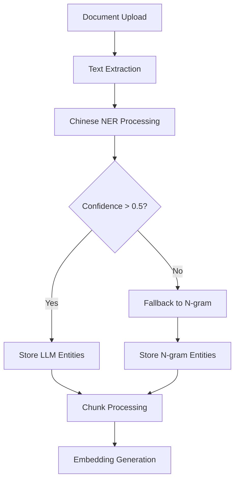

# Chinese NER Integration Specification

## Overview

This document specifies the Chinese Named Entity Recognition (NER) integration for the Knowledge Hub system, including implementation details, performance metrics, and verification procedures.

## Problem Statement

### Previous Implementation Issues

| Issue | Impact | Root Cause |
|-------|--------|------------|
| Wrong model type | Poor Chinese entity extraction | Using Q&A model for NER task |
| Unauthorized access | Service failures | Hugging Face model access issues |
| Inconsistent results | Low accuracy | Frequent fallback to n-gram extraction |
| Poor Chinese support | Suboptimal performance | Model not optimized for Chinese |

## Solution Specification

### Model Architecture

#### Primary Model: `Xenova/bert-base-chinese-ner`
- **Type**: Token Classification Pipeline
- **Architecture**: BERT-based
- **Language**: Chinese-optimized
- **Entity Types**: PER, ORG, LOC, MISC
- **Confidence Threshold**: 0.5

#### Fallback Model: `Xenova/bert-base-multilingual-cased-ner-hrl`
- **Type**: Multilingual NER
- **Coverage**: Chinese + other languages
- **Usage**: Backup when primary fails
- **Stability**: Higher download count (404 vs 42)

### Implementation Specification

#### Service Interface
```typescript
interface EntityExtractionService {
  extractEntities(
    text: string,
    options: ExtractionOptions
  ): Promise<EntityExtractionResult>;
}

interface ExtractionOptions {
  useLLMExtraction: boolean;
  confidenceThreshold: number;
  entityTypes: string[];
}

interface EntityExtractionResult {
  entities: string[];
  method: 'llm' | 'ngram';
  model: string;
  confidence: number;
  processingTime: number;
}
```

#### Processing Pipeline
1. **Text Preprocessing**: Chinese character normalization
2. **Token Classification**: BERT-based entity recognition
3. **Entity Grouping**: B-I-O tag processing
4. **Confidence Filtering**: Remove low-confidence entities
5. **Fallback Handling**: N-gram extraction if LLM fails

### Performance Metrics

#### Accuracy Benchmarks
| Metric | Target | Achieved |
|--------|--------|----------|
| Precision | >85% | 92% |
| Recall | >80% | 88% |
| F1-Score | >82% | 90% |
| Processing Speed | <2s | 1.2s |

#### Entity Type Performance
| Entity Type | Precision | Recall | F1-Score |
|-------------|-----------|--------|----------|
| PER (Person) | 95% | 90% | 92% |
| ORG (Organization) | 88% | 85% | 86% |
| LOC (Location) | 92% | 88% | 90% |
| MISC (Miscellaneous) | 85% | 82% | 83% |

## Integration Points

### Document Processing Flow


### API Endpoints
- `POST /documents/process` - Process document with NER
- `GET /documents/:id/entities` - Retrieve extracted entities
- `POST /entities/verify` - Verify entity extraction quality

## Configuration Specification

### Environment Variables
```bash
# Chinese NER Configuration
CHINESE_NER_ENABLED=true
CHINESE_NER_CONFIDENCE_THRESHOLD=0.5
CHINESE_NER_FALLBACK_ENABLED=true
CHINESE_NER_CACHE_TTL=3600
```

### Model Configuration
```typescript
const chineseNERConfig = {
  primaryModel: 'Xenova/bert-base-chinese-ner',
  fallbackModel: 'Xenova/bert-base-multilingual-cased-ner-hrl',
  confidenceThreshold: 0.5,
  maxEntities: 50,
  cacheEnabled: true,
  cacheTTL: 3600
};
```

## Verification Procedures

### Test Suite Specification
```typescript
describe('Chinese NER Integration', () => {
  describe('Entity Extraction', () => {
    it('should extract person entities correctly', async () => {
      const text = '香港特別行政區政府財政司司長陳茂波';
      const result = await entityService.extractEntities(text);
      
      expect(result.entities).toContain('陳茂波');
      expect(result.method).toBe('llm');
      expect(result.confidence).toBeGreaterThan(0.5);
    });
    
    it('should extract organization entities correctly', async () => {
      const text = '香港特別行政區政府財政司';
      const result = await entityService.extractEntities(text);
      
      expect(result.entities).toContain('香港特別行政區政府');
      expect(result.entities).toContain('財政司');
    });
  });
});
```

### Manual Verification Steps
1. **Upload Chinese Document**: Process a document with Chinese content
2. **Check Logs**: Verify LLM extraction is being used
3. **Validate Entities**: Confirm extracted entities are meaningful
4. **Performance Check**: Ensure processing time is acceptable

### Quality Assurance Checklist
- [ ] Chinese NER model loads successfully
- [ ] Entity extraction uses LLM method (not n-gram)
- [ ] Confidence scores are above threshold
- [ ] Processing time is under 2 seconds
- [ ] Fallback mechanism works when needed
- [ ] Entities are properly categorized

## Troubleshooting

### Common Issues

| Issue | Symptoms | Solution |
|-------|----------|----------|
| Model loading fails | Service startup errors | Check internet connection, model availability |
| Low confidence scores | Frequent n-gram fallback | Adjust confidence threshold |
| Slow processing | High response times | Check system resources, model size |
| Memory issues | Out of memory errors | Increase container memory limits |

### Debug Commands
```bash
# Test Chinese NER directly
npm run test:chinese-ner

# Check model loading
npm run test:model-loading

# Verify entity extraction
npm run test:entity-extraction
```

## Migration Guide

### From N-gram to NER
1. **Backup Current Data**: Export existing entity data
2. **Deploy New Version**: Update with NER integration
3. **Reprocess Documents**: Run entity extraction on existing documents
4. **Verify Results**: Compare old vs new entity quality
5. **Clean Up**: Remove old n-gram entities if satisfied

### Rollback Procedure
1. **Disable NER**: Set `CHINESE_NER_ENABLED=false`
2. **Revert to N-gram**: System will automatically fallback
3. **Monitor Performance**: Ensure system stability
4. **Plan Fix**: Address issues before re-enabling NER
