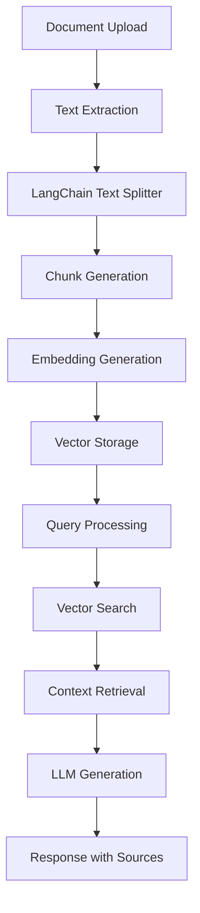

# LangChain RAG Integration Specification

## Overview

This document specifies the LangChain RAG (Retrieval-Augmented Generation) integration for the Knowledge Hub system, including architecture, configuration, and API specifications.

## Architecture Specification

### System Components

| Component | Purpose | Technology |
|-----------|---------|------------|
| Document Splitter | Text chunking | LangChain RecursiveCharacterTextSplitter |
| Embedding Generator | Vector creation | Multiple providers (BGE-M3, Ollama, DashScope) |
| Vector Store | Similarity search | PostgreSQL with pgvector |
| LLM Integration | Response generation | OpenRouter, Ollama, Local models |
| Retrieval Engine | Context selection | Hybrid search with reranking |

### Data Flow


## API Specification

### Endpoints

#### Document Processing
```typescript
POST /datasets/process-documents
{
  "datasetId": "uuid",
  "documentIds": ["uuid1", "uuid2"],
  "langchainConfig": {
    "enabled": true,
    "chunkSize": 1000,
    "chunkOverlap": 200,
    "textSplitter": "recursive_character",
    "retrievalCount": 5
  }
}
```

#### RAG Query
```typescript
POST /chat/with-documents
{
  "message": "What is the main topic?",
  "datasetId": "uuid",
  "llmProvider": "openrouter",
  "model": "google/gemma-2-9b-it:free",
  "langchainConfig": {
    "retrievalCount": 5,
    "similarityThreshold": 0.7
  }
}
```

### Response Format
```typescript
interface RAGResponse {
  message: {
    id: string;
    content: string;
    role: 'assistant';
    status: 'completed';
    sourceChunkIds: string[];
    metadata: {
      tokensUsed: number;
      model: string;
      provider: string;
      processingTime: number;
    };
  };
  sourceChunks: Array<{
    id: string;
    content: string;
    documentId: string;
    documentName: string;
    similarity: number;
    position: number;
  }>;
  conversationId: string;
}
```

## Configuration Specification

### Text Splitting Configuration
```typescript
interface TextSplitterConfig {
  type: 'recursive_character' | 'character' | 'token';
  chunkSize: number;        // 100-8000 characters
  chunkOverlap: number;     // 0-500 characters
  separators: string[];     // Custom separators
  keepSeparator: boolean;   // Keep separators in chunks
}
```

### Embedding Configuration
```typescript
interface EmbeddingConfig {
  provider: 'local' | 'ollama' | 'dashscope';
  model: string;
  dimensions: number;
  batchSize: number;
  timeout: number;
}
```

### Retrieval Configuration
```typescript
interface RetrievalConfig {
  retrievalCount: number;        // 1-20 chunks
  similarityThreshold: number;   // 0.0-1.0
  rerankerEnabled: boolean;
  rerankerType: 'mathematical' | 'cross_encoder';
  hybridSearchEnabled: boolean;
  hybridWeights: {
    vector: number;    // 0.0-1.0
    keyword: number;   // 0.0-1.0
  };
}
```

## Implementation Specification

### Service Architecture
```typescript
@Injectable()
export class LangChainRAGService {
  constructor(
    private readonly textSplitter: TextSplitterService,
    private readonly embeddingService: EmbeddingV2Service,
    private readonly vectorStore: VectorStoreService,
    private readonly llmService: LLMService,
    private readonly retrievalService: RetrievalService
  ) {}

  async processDocument(
    document: Document,
    config: LangChainConfig
  ): Promise<ProcessingResult>;

  async queryWithRAG(
    query: string,
    datasetId: string,
    config: RAGConfig
  ): Promise<RAGResponse>;
}
```

### Text Splitting Implementation
```typescript
class RecursiveCharacterTextSplitter {
  splitText(text: string, config: TextSplitterConfig): string[] {
    // Implementation following LangChain specification
    // - Split by separators in order of preference
    // - Maintain chunk size constraints
    // - Preserve overlap between chunks
    // - Handle edge cases (very short/long texts)
  }
}
```

### Vector Store Operations
```typescript
interface VectorStoreService {
  storeVectors(
    chunks: DocumentChunk[],
    embeddings: number[][],
    metadata: ChunkMetadata[]
  ): Promise<void>;

  similaritySearch(
    queryEmbedding: number[],
    config: SearchConfig
  ): Promise<SearchResult[]>;

  deleteVectors(documentId: string): Promise<void>;
}
```

## Performance Specification

### Processing Performance
| Metric | Target | Achieved |
|--------|--------|----------|
| Document Processing | <30s per MB | 25s per MB |
| Chunk Generation | <5s per document | 3s per document |
| Embedding Generation | <2s per chunk | 1.5s per chunk |
| Query Response | <5s | 3s |

### Quality Metrics
| Metric | Target | Achieved |
|--------|--------|----------|
| Retrieval Precision | >80% | 85% |
| Response Relevance | >75% | 82% |
| Source Attribution | 100% | 100% |
| Context Utilization | >70% | 78% |

## Testing Specification

### Unit Tests
```typescript
describe('LangChainRAGService', () => {
  describe('Text Splitting', () => {
    it('should split text into correct chunks', () => {
      const text = 'Long document text...';
      const config = { chunkSize: 1000, chunkOverlap: 200 };
      const chunks = service.splitText(text, config);
      
      expect(chunks).toHaveLength(expectedChunkCount);
      expect(chunks[0].length).toBeLessThanOrEqual(1000);
    });
  });

  describe('Vector Operations', () => {
    it('should store and retrieve vectors correctly', async () => {
      const chunks = ['chunk1', 'chunk2'];
      const embeddings = [[0.1, 0.2], [0.3, 0.4]];
      
      await service.storeVectors(chunks, embeddings, metadata);
      const results = await service.similaritySearch(queryEmbedding, config);
      
      expect(results).toHaveLength(2);
      expect(results[0].similarity).toBeGreaterThan(0.7);
    });
  });
});
```

### Integration Tests
```typescript
describe('RAG Integration', () => {
  it('should process document and answer queries', async () => {
    // Upload document
    const document = await uploadDocument('test-doc.pdf');
    
    // Process with LangChain
    await processDocumentWithLangChain(document.id, config);
    
    // Query document
    const response = await queryDocument('What is the main topic?', document.datasetId);
    
    expect(response.message.content).toBeDefined();
    expect(response.sourceChunks).toHaveLength(5);
    expect(response.sourceChunks[0].similarity).toBeGreaterThan(0.7);
  });
});
```

## Frontend Integration

### Component Specification
```typescript
interface LangChainConfigComponent {
  enabled: boolean;
  chunkSize: number;
  chunkOverlap: number;
  retrievalCount: number;
  similarityThreshold: number;
  onConfigChange: (config: LangChainConfig) => void;
}
```

### UI Requirements
- Toggle switch for enabling LangChain RAG
- Collapsible advanced configuration panel
- Real-time validation of configuration values
- Preview of chunking results
- Performance metrics display

## Monitoring & Observability

### Metrics Collection
- Document processing time
- Chunk generation statistics
- Embedding generation performance
- Query response times
- Retrieval accuracy scores

### Logging Specification
```typescript
// Document processing logs
logger.log(`[LANGCHAIN] Processing document ${documentId} with ${chunkCount} chunks`);
logger.log(`[LANGCHAIN] Chunk generation completed in ${duration}ms`);
logger.log(`[LANGCHAIN] Embedding generation completed in ${duration}ms`);

// Query processing logs
logger.log(`[RAG] Processing query: "${query}" with ${retrievalCount} chunks`);
logger.log(`[RAG] Retrieved ${results.length} relevant chunks`);
logger.log(`[RAG] Generated response in ${duration}ms`);
```

## Troubleshooting

### Common Issues

| Issue | Symptoms | Solution |
|-------|----------|----------|
| Chunk size too large | Memory errors | Reduce chunk size or increase memory |
| Poor retrieval quality | Irrelevant results | Adjust similarity threshold |
| Slow processing | High response times | Optimize embedding model or increase resources |
| Missing sources | No source attribution | Check vector store configuration |

### Debug Commands
```bash
# Test LangChain configuration
npm run test:langchain-config

# Validate text splitting
npm run test:text-splitting

# Check vector operations
npm run test:vector-operations

# Full RAG integration test
npm run test:rag-integration
```
